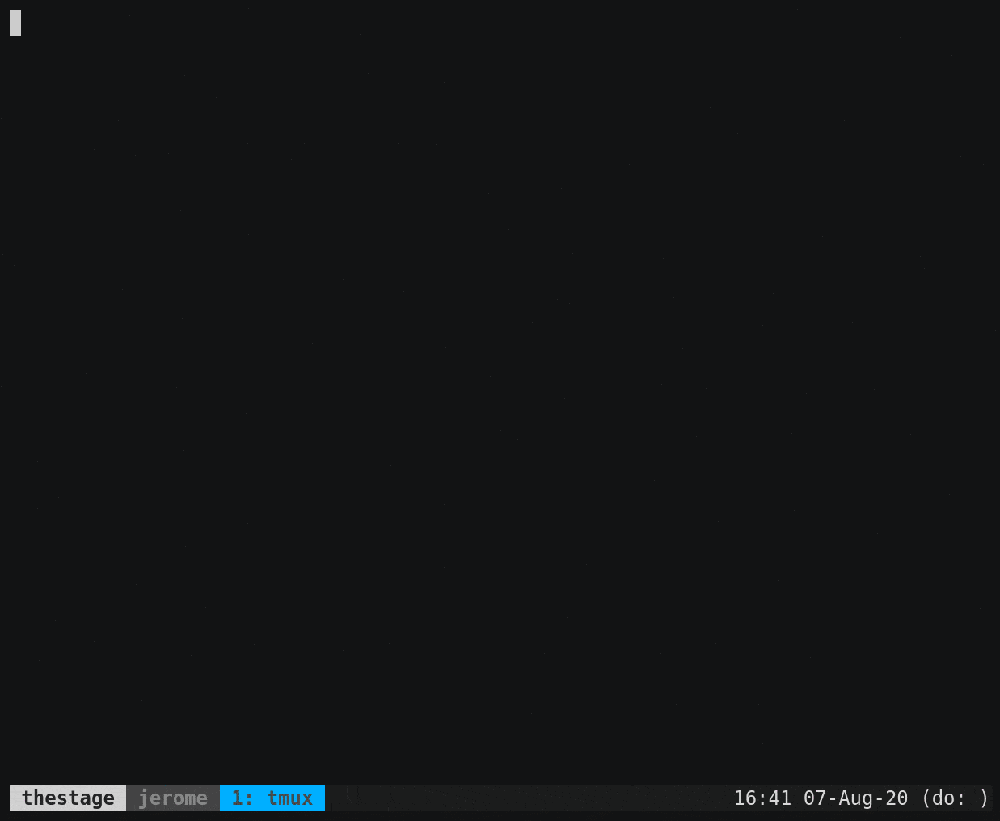

# tax, CLI Task List Manager

Displays / manages the tasks in `~/tasks.md`, or from the file pointed by `$TAX_FILE` if set.

Tasks are markdown:

```markdown
# Things to do

- [x] Do the laundry
- [ ] **Call mom**
- [ ] Send that email
```

**tax** offers basic operations to manage a task list from the CLI.




## Build/Install

Building and installing requires Rust: https://www.rust-lang.org/tools/install

```sh
cargo install tax
```

## Task file format

### Task

Tasks are single text lines.

Open tasks are with prefixed with `- [ ]`. Completed tasks are prefixed with `- [x]`.

```markdown
- [ ] This is an open task
- [x] This is a completed task
```

### Comment in task

Tasks can have comments. This is useful to keep the task name short while providing detailed information.

```markdown
- [ ] Do this thing // this a comment; see http://example.com/issue/#555
```

A comment is signaled by `//`, except when immediately preceded by `:`. That way, URLS can be included in tasks without being parsed as comments.

For instance, this task does not have a comment:

```markdown
- [ ] http://github.com/tax/issues
```

### Focused task

Tasks in bold markup are focused. They will be displayed with priority over non focused tasks when a subset of the task list is displayed.

```markdown
- [ ] **This is a focused task**
```

Focused tasks can have a comment; in that case, only the task name is focused, not the comment

```markdown
- [ ] **This is a focused task** // with a comment, outside of the focus
```

### Section

A task file can optionnaly feature sections, subdivizing the task list in sub-lists.

A section is denoted by a markdown Header of any level.

When the task file contains only one section, **tax** will behave the same as without any section.

```
# Job

- [ ] Send that email

## Perso

- [ ] Fix the roof
- [ ] Prepare Korean BBQ
```

Sections can be focused. When a section is focused, **tax** will display only the tasks it contains.

## Commands

#### `tax list [-a|--all]`

Alias `tax`, `tax ls`.

Print all open tasks of the list, or of the focused section if any.

If `-a|--all` is set, all open tasks will be listed, regardless of section focus.

#### `tax current`

Print the first open (focused if any) task of the list. Useful in prompt or tmux status.

#### `tax cycle`

Like `tax current`, but changes task every minute if no task is focused.

#### `tax cat`

Alias `tax view`.

Print the content of the task file without any processing.

#### `tax check $TASK_NUM` and `tax uncheck $TASK_NUM`

Checks/Unchecks the task corresponding to the given number `$TASK_NUM`.

#### `tax focus $TASK_NUM` and `tax blur $TASK_NUM`

Focuses/Blurs the task corresponding to the given number `$TASK_NUM`.

A focused task is a bold task in markdown formatting.

Ex:

```markdown
- [ ] **This is a focused task**
```

Focused tasks will be displayed with priority over non focused tasks by the `tax current` and `tax cycle` commands.

#### `tax focus $SECTION` and `tax blur $SECTION`

Focuses/Blurs the section corresponding to the given name `$SECTION`.

A focused section is a bold header in markdown formatting.

Ex:

```markdown
# **This is a focused section**
- [ ] Some task
```

When a section is focused, **tax** will display the tasks of this section only.

#### `tax add [-s "section"|--section "section"] "The task"`

Aliases: `tax push`, `tax prepend`.

Adds the given task to the task list.

If `-s|--section` is provided, the task will be added to the matching section.

If a section is focused, the task will be added to the focused section.

Otherwise, the task will be added at the top of the task list.

#### `tax append [-s "section"|--section "section"] "The task"`

Like `tax add`, but appends the task to the list instead of pushing it on top.

#### `tax prune`

Removes all checked tasks from the task list.

#### `tax edit`

Opens the current task file in `$EDITOR`.

#### `tax which`

Tells which tasks file is currently in use. Useful for scripting.

## Use

### Include in prompt

```sh
# Put tax in your $PATH or:
# alias tax=/path/to/tax
```

Then, to display the current task in your bash prompt:

```sh
export PS1='= $(tax current)
> '
```

Replace `tax current` with `tax cycle` for the displayed task to change every minute.

### Include in tmux status

In your `tmux.conf`, for instance:

```sh
set -g status-right '[...your status config...] #(/path/to/tax cycle)'
```

## Color support

If **tax** is running in the context of a TTY, it will emit ANSI escape sequences to display focused tasks in bold font, instead of markdown bold markup.

If **tax** is not running in a TTY (for instance, in a shell `$PS1`), emitting ANSI escape sequences can be forced by setting the environment variable `CLICOLOR_FORCE=1`.

You can disable all ANSI escape sequences by setting the environment variable `NO_COLOR=1`.

Note: tmux status line does not interpret ANSI escape sequences (not a TTY).

### React to changes

If `$TAX_CHANGE_CMD` is set in the environment and contains a valid command, **tax** will execute it as a `sh` command after every change it makes to your task file.

**tax** exposes a set of environment variables to `$TAX_CHANGE_CMD` to provide information about the change.

* **For all tax commands:**
  * `$TAX_FILE`: the absolute path of the changed tasks file
  * `$TAX_FILE_FOLDER`: the absolute path of the folder containing the tasks file
  * `$TAX_CMD`: the command that applied the change; one of `add`, `check`, `edit`, `focus`, `prune`
  * `$TAX_OPERATION`: the operation applied to the file; one of `APPEND`, `PREPEND`, `CHECK`, `UNCHECK`, `EDIT`, `FOCUS`, `BLUR`, `PRUNE`
  * `$TAX_MESSAGE`: a human-readable description of the change, include the task name if available

* **For commands add, check, uncheck, focus, blur (post-change values)**
  * `$TAX_TASK_NUM`: the number of the changed task in the task list (1-indexed)
  * `$TAX_TASK_NAME`: the name of the changed task
  * `$TAX_TASK_PLAIN_NAME`: the plain name of the changed task (without focus markup if present)
  * `$TAX_TASK_LINE`: the complete markdown line of the changed task
  * `$TAX_TASK_LINE_NUM`: the line number of the changed task
  * `$TAX_TASK_CHECKED`: `1` if the task is completed, `0` otherwise
  * `$TAX_TASK_FOCUSED`: `1` if the task is focused, `0` otherwise

I use it to version my task file using this command:

```sh
export TAX_CHANGE_CMD='git -C "$TAX_TAXFILE_FOLDER" commit -am "$TAX_MESSAGE"'
```

## License

See [LICENSE.md]()
