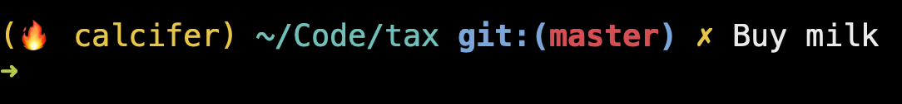

# tax, the prompt task list [](https://circleci.com/gh/netgusto/tax)

Displays the next pending task from `~/taxfile`, or from the content of the file pointed by `$TAXFILE` if set.

Tasks are markdown:

```
# Things to do

- [*] Do the laundry
- [ ] Be good
- [ ] Send that email
```

When run, `tax` will pick one open task from the taxfile and display it. If no task is open, it displays nothing.

The displayed task rotates every minute.

Meant to be included in prompt or tmux status.

## Include in prompt

```
# Put tax in your $PATH or:
# alias tax=/path/to/tax

export PS1='= $(tax)
> '
```

Ex on my prompt:



## Include in tmux status

In your `tmux.conf`, for instance:

```
set -g status-right '[...your status config...] #(/path/to/tax)'
```

## Edit tasks

To edit the currently used taxfile in `$EDITOR`:

```
tax edit
```

Requires `$EDITOR` to be set and valid.

## License

See [LICENSE.md]()
