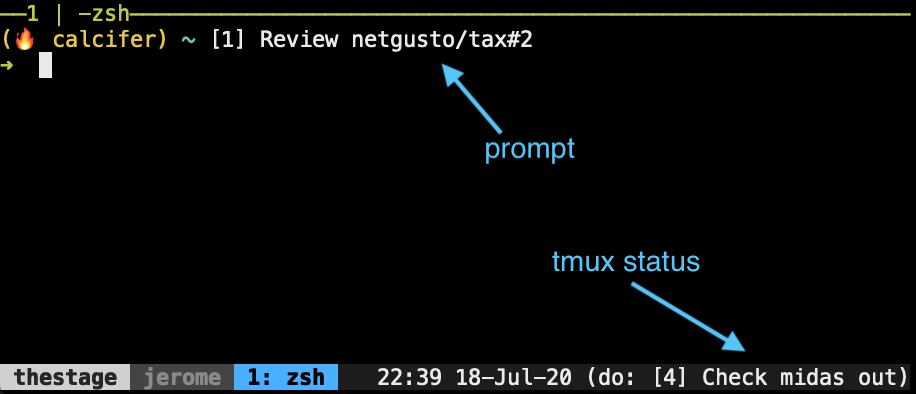
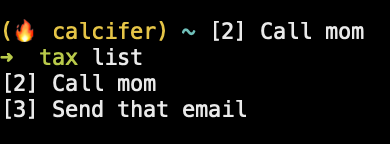
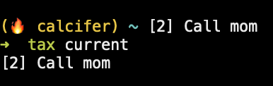
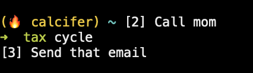
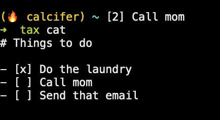
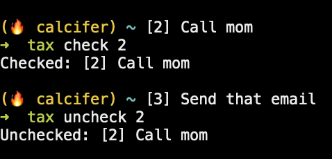
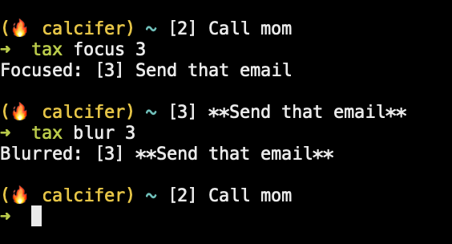
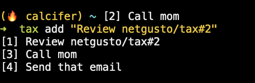
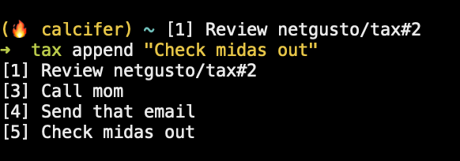
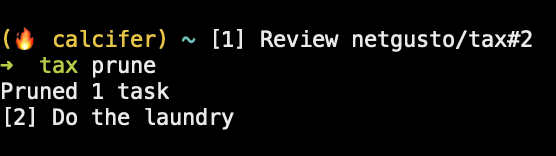

# tax, the prompt task list [](https://circleci.com/gh/netgusto/tax)

Displays / manages the tasks in `~/tasks.md`, or from the file pointed by `$TAX_FILE` if set.

Tasks are markdown:

```markdown
# Things to do

- [x] Do the laundry
- [ ] **Call mom**
- [ ] Send that email
```

tax is meant to offer basic operations to handle a task list from the CLI, optionally displaying the tasks one at a time on your bash prompt and your tmux status line.



## Commands

### tax | tax list

Displays the current list of open tasks.



### tax current

Displays the first open task of the list.



Meant to be included in prompt or tmux status.

### tax cycle

Picks one open task from the list and display it. **The picked task changes every minute.**



Meant to be included in prompt or tmux status.

### tax cat

Alias: `tax view`.

Displays the content of the taxfile without any processing.



### tax check $TASK_NUM | tax uncheck $TASK_NUM

Checks/Unchecks the task corresponding to the given number `$TASK_NUM`.



### tax focus $TASK_NUM | tax blur $TASK_NUM

Focuses/Blurs the task corresponding to the given number `$TASK_NUM`.

A focused task is a bold task in markdown formatting.

Ex:

```markdown
- [ ] **This is a focused task**
```

Focused tasks will be displayed with priority over non focused tasks by the `tax current` and `tax cycle` commands.



### tax add "The task"

Aliases: `tax push`, `tax prepend`.

Adds the given task on top of the first task of the list.



### tax append "The task"

Appends the given task after the last task of the list.



### tax prune

Removes all checked tasks from the task list.



### tax edit

Opens the current task file in `$EDITOR`.

### tax which

Tells which tasks file is currently in use. Useful for scripting.

## Build/Install

Building and installing requires Rust: https://www.rust-lang.org/tools/install

```sh
cargo install tax
```

## Use

### Include in prompt

```sh
# Put tax in your $PATH or:
# alias tax=/path/to/tax
```

Then, to display the current task in your bash prompt:

```sh
export PS1='= $(tax current)
> '
```

Replace `tax current` with `tax cycle` for the displayed task to change every minute.

### Include in tmux status

In your `tmux.conf`, for instance:

```sh
set -g status-right '[...your status config...] #(/path/to/tax cycle)'
```

### React to changes

If `$TAX_CHANGE_CMD` is set in the environment and contains a valid command, tax will execute it as a `sh` command after every change it makes to your task file.

tax exposes a set of environment variables to `$TAX_CHANGE_CMD` to provide information about the change.

* **For all tax commands:**
  * `$TAX_FILE`: the absolute path of the changed tasks file
  * `$TAX_FILE_FOLDER`: the absolute path of the folder containing the tasks file
  * `$TAX_CMD`: the command that applied the change; one of `add`, `check`, `edit`, `focus`, `prune`
  * `$TAX_OPERATION`: the operation applied to the file; one of `APPEND`, `PREPEND`, `CHECK`, `UNCHECK`, `EDIT`, `FOCUS`, `BLUR`, `PRUNE`
  * `$TAX_MESSAGE`: a human-readable description of the change, include the task name if available

* **For commands add, check, uncheck, focus, blur (post-change values)**
  * `$TAX_TASK_NUM`: the number of the changed task in the task list (1-indexed)
  * `$TAX_TASK_NAME`: the name of the changed task
  * `$TAX_TASK_LINE`: the complete markdown line of the changed task
  * `$TAX_TASK_LINE_NUM`: the line number of the changed task
  * `$TAX_TASK_CHECKED`: `1` if the task is completed, `0` otherwise
  * `$TAX_TASK_FOCUSED`: `1` if the task is focused, `0` otherwise

I use it to version my task file using this command:

```sh
export TAX_CHANGE_CMD='git -C "$TAX_TAXFILE_FOLDER" commit -am "$TAX_MESSAGE"'
```

## License

See [LICENSE.md]()
